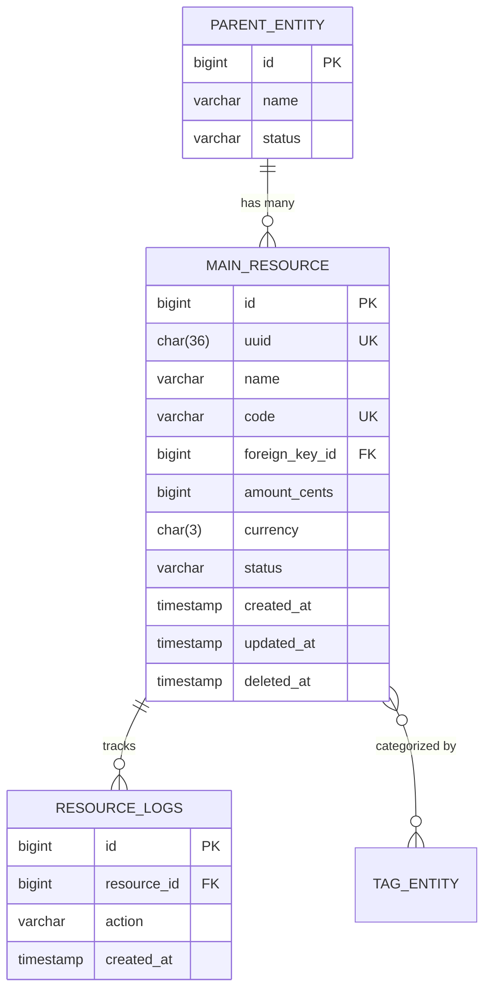
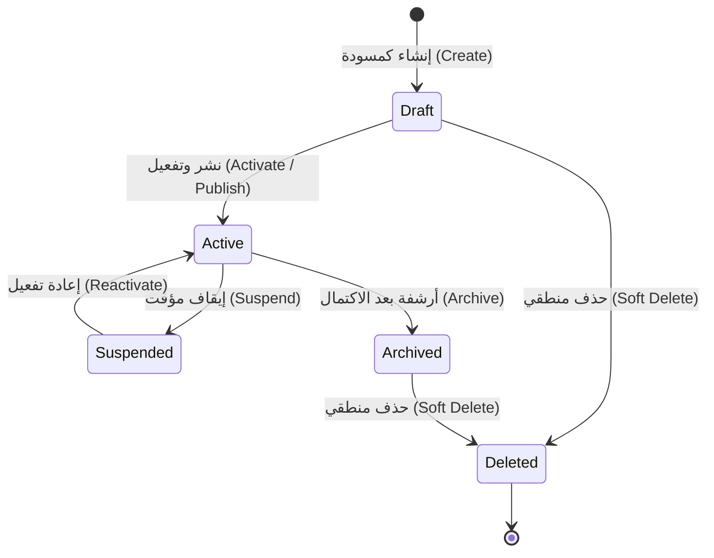

# 📊 مواصفات البيانات والكيانات — [اسم المرحلة / Phase Name]

> **الهدف:** توثيق المخطط الهيكلي للجداول والكيانات، والعلاقات، والفهارس، وقيود النزاهة، ودورة حياة الحالات الخاصة بهذه المرحلة، والمشتقة بالكامل من مخطط قاعدة البيانات المعتمد في `MD/database.md`.

---

## 1. جدول وكيان المرحلة (`[table_name]`)

### 1.1 حقول الجدول والأنواع (Table Schema)

| اسم الحقل | نوع البيانات (SQL Data Type) | القيود والخصائص (Constraints) | الوصف والدلالة الوظيفية |
| :--- | :--- | :--- | :--- |
| `id` | `BIGINT UNSIGNED` | `PRIMARY KEY AUTO_INCREMENT` | المعرف الرقمي الأساسي الداخلي للكيان. |
| `uuid` | `CHAR(36)` | `UNIQUE NOT NULL` | المعرف الفريد الخارجي الآمن (يُستخدم في الـ API لمنع تخمين المعرفات). |
| `[name / title]` | `VARCHAR(255)` | `NOT NULL` | الاسم أو العنوان التعريفي للكيان. |
| `[code / sku]` | `VARCHAR(100)` | `NOT NULL` | الرمز الفريد للكيان ضمن نطاق النظام/المستأجر. |
| `[description]` | `TEXT` | `NULLABLE` | الشرح أو الوصف التفصيلي. |
| `[foreign_key_id]` | `BIGINT UNSIGNED` | `NOT NULL, INDEXED` | المفتاح الأجنبي المرتبط بالكيان الأب في جدول `[foreign_table]`. |
| `[amount_cents]` | `BIGINT` | `DEFAULT 0, NOT NULL` | القيمة المالية مقدرة بالوحدات الصغرى (السنت/الهللة) إن وُجدت. |
| `currency` | `CHAR(3)` | `DEFAULT 'USD', NOT NULL` | رمز العملة المعياري المعتمد (ISO 4217). |
| `status` | `VARCHAR(50)` | `DEFAULT 'draft', NOT NULL` | حالة الكيان الحالية (`draft`, `active`, `archived`, `suspended`). |
| `created_at` | `TIMESTAMP` | `NULLABLE` | وقت وتاريخ الإنشاء (UTC). |
| `updated_at` | `TIMESTAMP` | `NULLABLE` | وقت وتاريخ آخر تعديل (UTC). |
| `deleted_at` | `TIMESTAMP` | `NULLABLE` | وقت وتاريخ الحذف المنطقي (Soft Delete). |

> **قيد صارم:** هذا الجدول وحقوله وقيوده مستمد بالكامل وبدقة 1:1 من `MD/database.md`. يُحظر استحداث أو تعديل أي حقل برمجياً أثناء تنفيذ المرحلة.

---

## 2. العلاقات والتكامل المرجعي (Relationships & Foreign Keys)

| الكيان المرتبط | نوع العلاقة | الحقل المحلي (Local Key) | الحقل الخارجي (Target Key) | سلوك الحذف (`ON DELETE`) |
| :--- | :--- | :--- | :--- | :--- |
| `[parent_table]` | `BelongsTo` | `[foreign_key_id]` | `[parent_table].id` | `RESTRICT` (منع حذف الأب عند وجود أبناء) |
| `[child_logs_table]` | `HasMany` | `id` | `[child_logs_table].[resource]_id` | `CASCADE` (حذف السجلات التابعة) |
| `[related_tags_table]` | `BelongsToMany` | `id` | جدول وسيط `[pivot_table]` | `CASCADE` |

---

## 3. الفهارس وقيود التفرد (Indexes & Constraints)

### 3.1 قيود التفرد (Unique Constraints)
- `uq_[table]_[code]`: يمنع تكرار `[code / sku]` (مع مراعاة نطاق المستأجر `[tenant_id]` إن وُجد النظام المتعدد).

### 3.2 فهارس تحسين الاستعلامات (Performance Indexes)
- `idx_[table]_[foreign_key_id]`: فهرس المفتاح الأجنبي لتسريع عمليات الربط والتحميل المسبق (`Eager Loading`).
- `idx_[table]_status`: فهرس حقل الحالة لتسريع عمليات الفلترة بالقوائم.
- `idx_[table]_created_at`: فهرس لتسريع ترتيب النتائج الأحدث فالأحدث في الترقيم (Pagination).
- `idx_[table]_composite_search`: فهرس مركب (`[foreign_key_id]`, `status`, `deleted_at`) لتسريع الاستعلامات الأكثر تكراراً في الـ API.

---

## 4. مخطط الكيانات والعلاقات (Entity Relationship Diagram - ERD)

---

## 5. دورة حياة الكيان ومصفوفة الحالات (State Machine & Transitions)

### مصفوفة التحولات المسموحة:
- **`draft` ➔ `active`:** مسموح عند اكتمال كافة الحقول الإلزامية واجتياز التحقق.
- **`active` ➔ `suspended`:** مسموح للمستخدم المخول بتعطيل العنصر مؤقتاً.
- **`active` ➔ `archived`:** مسموح عند انتهاء دورة العمل المرتبطة به.
- **الحذف المنطقي (`deleted_at`):** متاح من أي حالة شرط عدم وجود عمليات نشطة تمنع الحذف.

---

## 6. المعايير المالية والنقدية (Financial Invariants — إن وُجدت)

في حال احتواء الكيان على معاملات نقدية أو تسعير:
1. **التخزين بوحدات السنت (Minor Units):** تخزين كافة المبالغ في حقل `*_cents` كأعداد صحيحة (`BIGINT`). مثال: `$10.50` تُخزن كـ `1050`.
2. **رمز العملة المعياري:** حقل `currency` إلزامي ويتبع معيار `ISO 4217` بثلاثة أحرف (مثل: `USD`, `EUR`, `SAR`).
3. **حظر الفواصل العشرية العائمة:** **يُمنع منعاً باتاً** استخدام حقول `FLOAT` أو `DOUBLE` للقيم المالية لتجنب أخطاء التقريب الحسابي.

---

## 7. سياسة الحذف المنطقي والنزاهة التاريخية (Soft Deletion Policy)

1. **تسجيل وقت الحذف:** يتم وسم السجل بتسجيل التوقيت في حقل `deleted_at`.
2. **العزل التلقائي:** يتم استبعاد السجلات التي تحتوي على `deleted_at IS NOT NULL` تلقائياً من كافة استعلامات القراءة العادية.
3. **الحفاظ على التاريخ:** لا يتم إطلاقاً حذف السجلات المرتبطة بحركات محاسبية أو سجلات تدقيق تاريخية من قاعدة البيانات.

---

## 8. مطابقة المخطط ومصدر الحقيقة (SSoT Alignment)

- كافة تعريفات الجداول، والأنواع، والعلاقات، والفهارس المذكورة في هذه الوثيقة متطابقة تماماً مع المصدر الرئيسي للحقيقة:
  `MD/database.md`
- تلتزم حزم العمل البرمجية المنفذة في هذه المرحلة بهذا المخطط دون أي انحراف، وتُدار قواعد العمل العامة المطبقة على هذه البيانات وفق `MD/business_rules.md`.
