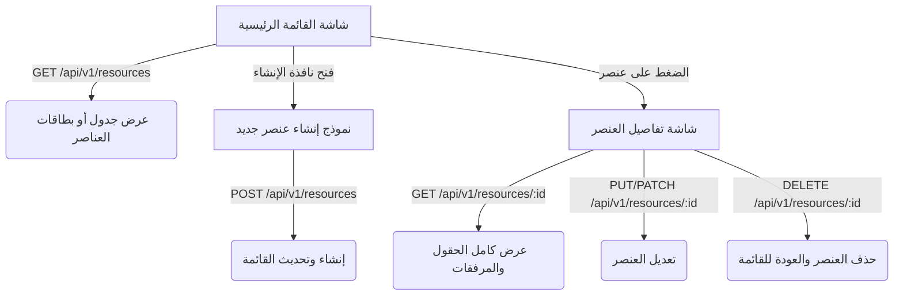
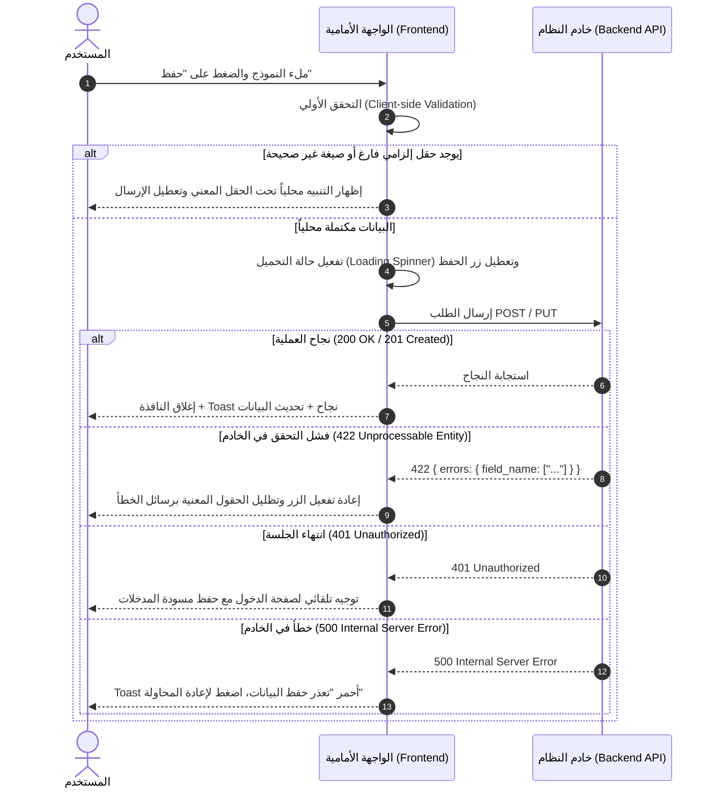

# 🖥️ مواصفات Frontend — [اسم المرحلة / Phase Name] (نمط API-First)

> **الهدف:** توفير واجهات وتجارب استخدام تفاعلية ومتكاملة لإدارة الكيان المستهدف عبر الاتصال بنقاط الـ API الخلفية، مع تطبيق نظام التصميم المعتمد، والتجاوب الكامل مع كافة الأجهزة، ودعم الاتجاه الأصيل (`dir="rtl"`).

---

## 1. بنية العميل وتدفق البيانات (API Client Architecture)

### 1.1 الترويسات العامة (Common Request Headers)
يتم إرفاق الترويسات التالية تلقائياً مع جميع طلبات الـ Frontend:
```http
Authorization: Bearer <ACCESS_TOKEN>
Accept: application/json
Accept-Language: ar
Content-Type: application/json
```

### 1.2 مصفوفة التعامل الشامل مع استجابات الـ HTTP (Global HTTP Status Matrix)

| كود الحالة | نوع الحالة | سلوك الواجهة وتجربة المستخدم (Frontend UX Action) |
| :--- | :--- | :--- |
| **`200 OK`** | نجاح الطلب | تحديث واجهة المستخدم فوراً وعرض البيانات / إغلاق النوافذ المنبثقة. |
| **`201 Created`** | نجاح الإنشاء | إظهار إشعار نجاح (Toast أخضر) + تحديث القائمة تلقائياً (`Auto-refetch`). |
| **`204 No Content`** | نجاح الحذف | إزالة العنصر مباشرة من الواجهة مع إشعار تأكيد مقتضب. |
| **`304 Not Modified`** | كاش متطابق | استخدام البيانات المخزنة محلياً دون وميض أو إعادة تحميل الشاشة. |
| **`400 Bad Request`** | طلب غير صالح | عرض تنبيه خطأ عام في نافذة منبثقة أو أعلى النموذج. |
| **`401 Unauthorized`** | انتهاء الجلسة | مسح الـ Token المخزن محلياً وإعادة توجيه المستخدم لصفحة الدخول مع حفظ مسودة النموذج إن أمكن. |
| **`403 Forbidden`** | عدم امتلاك صلاحية | إظهار شاشة حظر وصول لطيفة (*Access Denied Card*) مع زر العودة للرئيسية. |
| **`404 Not Found`** | المورد غير موجود | عرض شاشة "العنصر غير موجود أو تم حذفه" مع زر العودة للقائمة الرئيسية. |
| **`409 Conflict`** | تعارض في الحالة | إشعار يفيد بتغير حالة العنصر من قِبل مستخدم آخر أو انتهاء صلاحية العملية. |
| **`422 Unprocessable`** | فشل التحقق (Validation) | تظليل الحقول الخاطئة باللون الأحمر وعرض رسائل الخطأ الدقيقة تحت كل حقل دون مسح المدخلات. |
| **`429 Too Many Requests`** | تجاوز معدل الطلبات | تعطيل أزرار الإرسال مؤقتاً وعرض عداد تنازلي للمحاولة لاحقاً. |
| **`500 / 502 / 503`** | أخطاء الخادم | إشعار عائم: `تعذر الاتصال بالخادم، يرجى المحاولة لاحقاً` مع زر إعادة المحاولة (*Retry*). |

---

## 2. نظام التصميم والاتجاه الأصيل (Design Tokens & RTL)

1. **رموز التصميم (Design Tokens):**
   - الالتزام التام بالمتغيرات المحددة في `MD/design_rules.md` لجميع الألوان، والظلال، والمسافات، ونصف القطر (Border Radius).
   - يُحظر تماماً استخدام ألوان صلبة (Hex Codes) خارج نظام التصميم المعتمد.
2. **الاتجاه الأصيل (Native RTL Support):**
   - الحاوية الجذرية تدعم `dir="rtl"`.
   - استخدام الخصائص المنطقية في التنسيق (`margin-inline-start`, `padding-inline-end`, `border-start-start-radius`).
3. **التجاوب مع الشاشات (Responsive Viewports):**
   - توافق كامل ومظهر سلس عبر الهواتف الذكية (Mobile 375px)، والأجهزة اللوحية (Tablet 768px)، والشاشات المكتبية (Desktop 1280px+).

---

## 3. قدرات وسياسات الواجهة (Frontend Capabilities)

وفق السياسات المعينة في `MD/frontend_capabilities.yaml`:

1. **فحص النماذج غير المحفوظة (`dirty_check`):**
   - إظهار تنبيه تأكيدي عند محاولة إغلاق النموذج أو مغادرة الصفحة إذا وُجدت تعديلات لم يتم حفظها.
2. **تأخير طلبات البحث (`debouncing`):**
   - تطبيق تأخير زمني (300ms) في حقول البحث النصي قبل إرسال طلب الـ API لمنع استنزاف الخادم.
3. **التحديث التفاؤلي (`optimistic_ui`):**
   - في العمليات السريعة مثل الحذف أو تغيير الحالة البسيطة، يتم تحديث الواجهة فوراً مع التراجع التلقائي في حال فشل الطلب.
4. **التحميل الكسول (`lazy_loading`):**
   - تطبيق التحميل الكسول للصور والمرفقات الثقيلة والمكونات الثانوية.

---

## 4. الشاشات والعمليات وربط الـ API (Screens & Operations)



---

### الشاشة (1): شاشة القائمة الرئيسية (`[Resource] List View`)

#### أ. المكونات والوظائف:
- **شريط الأدوات العلوي:** حقل بحث نصي (مع `Debounce`)، قوائم فلترة منسدلة حسب الحالة والتصنيف، وزر `+ إنشاء جديد`.
- **طريقة العرض:** جدول بيانات تفاعلي (DataTable) أو بطاقات (Cards) بحسب نوع البيانات وطبيعة الاستخدام.
- **الترقيم (Pagination):** شريط تنقل الصفحات مع تحديد عدد العناصر في الصفحة (`per_page: 20`).
- **أزرار الإجراءات السريعة بكل صف:** (عرض التفاصيل، تعديل، حذف).

#### ب. الـ Endpoints المستخدمة والإجراءات:

| الإجراء (UI Action) | الـ Endpoint | المعاملات (Payload / Query) | معالجة وسلوك الواجهة |
| :--- | :--- | :--- | :--- |
| **جلب القائمة** | `GET /api/v1/[resources]` | `?page=1&per_page=20&search=...&status=...` | **`200 OK`**: رسم العناصر وتحديث الترقيم.<br>**`200 (Empty)`**: عرض حالة الفراغ (*Empty State*).<br>**`500`**: عرض بطاقة خطأ مع زر إعادة المحاولة. |
| **حذف عنصر** | `DELETE /api/v1/[resources]/:id` | لا يوجد | **`200 / 204`**: إزالة الصف فوراً مع Toast تأكيدي.<br>**`403`**: تنبيه `لا تملك صلاحية الحذف`. |

---

### الشاشة (2): شاشة تفاصيل العنصر (`[Resource] Detail View`)

#### أ. المكونات والوظائف:
- **شريط العنوان والإجراءات (Action Bar):** عنوان العنصر، شارة الحالة (Status Badge)، أزرار (تعديل، تغيير الحالة، حذف، عودة).
- **بطاقة البيانات الأساسية:** استعراض كافة الحقول، والتواريخ، والارتباطات، والبيانات المالية (إن وُجدت).
- **قسم المرفقات والملفات:** استعراض المرفقات مع خيارات التحميل والمعاينة المباشرة.

#### ب. الـ Endpoints المستخدمة والإجراءات:

| الإجراء (UI Action) | الـ Endpoint | المعاملات (Payload) | معالجة وسلوك الواجهة |
| :--- | :--- | :--- | :--- |
| **جلب التفاصيل** | `GET /api/v1/[resources]/:id` | لا يوجد | **`200 OK`**: تعبئة البيانات وشارات الحالة.<br>**`404`**: تحويل لصفحة "العنصر غير موجود". |
| **تغيير الحالة** | `PATCH /api/v1/[resources]/:id` | `{ status: "[new_status]" }` | **`200 OK`**: تحديث الشارة فوراً + إشعار نجاح.<br>**`409`**: إشعار تعارض في الحالة. |

---

### الشاشة (3): نموذج الإنشاء والتعديل (`[Resource] Form Modal / Page`)

#### أ. المكونات والوظائف:
- حقول الإدخال النصية، والقوائم المنسدلة، وحقول التواريخ، ورفع الملفات (مع شريط تقدم الرفع).
- التحقق الفوري الأولي من الحقول قبل الإرسال (Client-side Validation).
- زر `حفظ` (مع مؤشر التحميل Spinner) وزر `إلغاء`.

#### ب. الـ Endpoints المستخدمة والإجراءات:

| الإجراء (UI Action) | الـ Endpoint | المعاملات (Payload) | معالجة وسلوك الواجهة |
| :--- | :--- | :--- | :--- |
| **إنشاء عنصر** | `POST /api/v1/[resources]` | `{ name, code, status, ... }` | **`201 Created`**: إغلاق النموذج + Toast أخضر + تحديث القائمة.<br>**`422`**: ربط رسائل الأخطاء تحت الحقول مباشرة. |
| **تعديل عنصر** | `PUT /api/v1/[resources]/:id` | `{ name, status, ... }` | **`200 OK`**: إغلاق النموذج + Toast نجاح + تحديث البيانات.<br>**`422`**: إظهار أخطاء التحقق. |

---

## 5. تدفق معالجة الأخطاء في النماذج (Form Validation UX Flow)



---

## 6. حالات الواجهة الأربع (UI States Coverage)

| الحالة (State) | متى تحدث؟ | التوصيف وسلوك الواجهة (UX Implementation) |
| :--- | :--- | :--- |
| **1. حالة التحميل (Loading)** | أثناء انتظار استجابة الـ API | عرض هياكل تحميل متحركة (*Skeleton Loaders*) في الجداول والبطاقات، وتعطيل الأزرار لمنع النقر المزدوج. |
| **2. حالة الفراغ (Empty)** | عند استرجاع مصفوفة فارغة `data: []` | عرض رسم توضيحي جذاب مع رسالة واضحة: `لا توجد عناصر حالياً` وزر مباشر لإنشاء أول عنصر. |
| **3. حالة الخطأ (Error)** | عند استلام `5xx` أو فشل الاتصال | عرض بطاقة خطأ مدمجة مع رسالة واضحة وزر مباشر `🔄 إعادة المحاولة (Retry)`. |
| **4. حالة النجاح (Success)** | بعد نجاح عمليات الحفظ/التعديل/الحذف | إغلاق النوافذ المنبثقة وعرض إشعار Toast عائم يختفي تلقائياً بعد 3-4 ثوانٍ. |

---

## 7. استراتيجية التخزين المؤقت وتحديث البيانات (Cache Strategy)

1. **إبطال الكاش عند التعديل (Mutation Invalidation):**
   - عند نجاح أي عملية تعديل (`POST`, `PUT`, `PATCH`, `DELETE`)، يتم تلقائياً وسم استعلامات القوائم بأنها قديمة (*Stale*) لإعادة جلبها في الخلفية فوراً لمنع عرض بيانات غير متزامنة.
2. **التحديث التفاؤلي (Optimistic UI Updates):**
   - عند حذف عنصر أو تغيير حالته، يتم تحديث الواجهة فوراً مع إمكانية التراجع التلقائي في حال استجابة الخادم بخطأ.

---

## 8. معايير القبول لتكامل الواجهة والـ API (Acceptance Criteria)

- [ ] كل شاشة وزر تفاعلي مرتبط صراحة بنقطة اتصال موثقة في `routes.md` و `backend.md`.
- [ ] تتولى الواجهة معالجة جميع رموز الـ `2xx` بتحديث البيانات وإظهار التغذية الراجعة المناسبة.
- [ ] يتم التعامل مع أخطاء `422` بربط رسائل الخطأ بالحقول المدخلة مباشرة ودون إعادة تحميل الصفحة.
- [ ] يتم التعامل مع `401` بإعادة التوجيه التلقائي لتسجيل الدخول دون انهيار التطبيق.
- [ ] يتم عرض رسائل وصول ممنوع لطيفة ومفيدة عند تلقي `403`.
- [ ] يتم عرض شاشة مخصصة لـ `404` عند طلب معرف عنصر محذوف أو غير موجود.
- [ ] يتم عرض خيار "إعادة المحاولة" عند تلقي أخطاء الخادم `5xx` أو انقطاع الاتصال.
- [ ] النماذج التي تتضمن رفع ملفات تدعم شريط تقدم الرفع (*Upload Progress Bar*).
- [ ] الالتزام التام بنظام الألوان والمسافات والرموز المعتمدة في `MD/design_rules.md`.
- [ ] دعم الاتجاه الأصيل `dir="rtl"` والتجاوب الكامل مع كافة أحجام الشاشات.

---

## 9. المرجعية المعمارية للمرحلة

تحدد هذه الوثيقة متطلبات الواجهة وتجربة المستخدم وعقد التكامل مع الـ API.

تعتمد تفاصيل بناء المكونات، ونظام إدارة الحالة (State Management)، ومكتبات العرض على:
1. التقنيات وقواعد العمل المحددة في `MD/stack.yaml`.
2. وثيقة نظام التصميم المعتمدة في `MD/design_rules.md`.
3. مصفوفة قدرات الواجهة في `MD/frontend_capabilities.yaml`.
